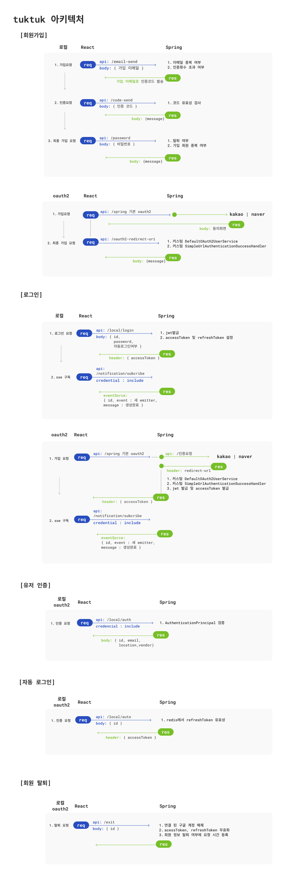
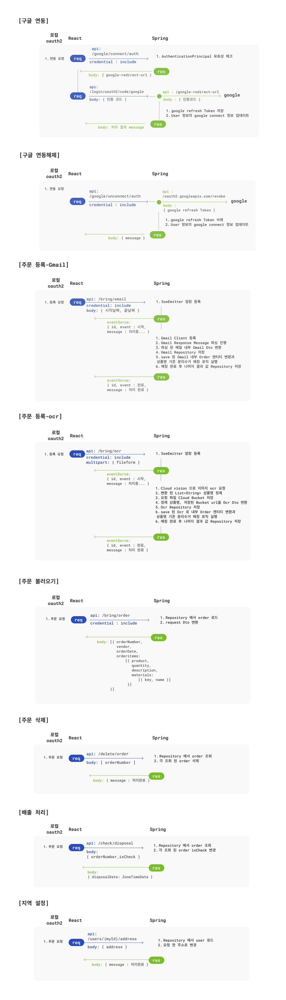
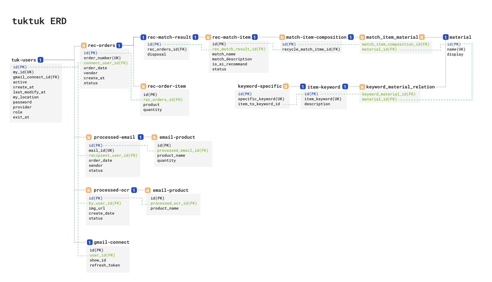
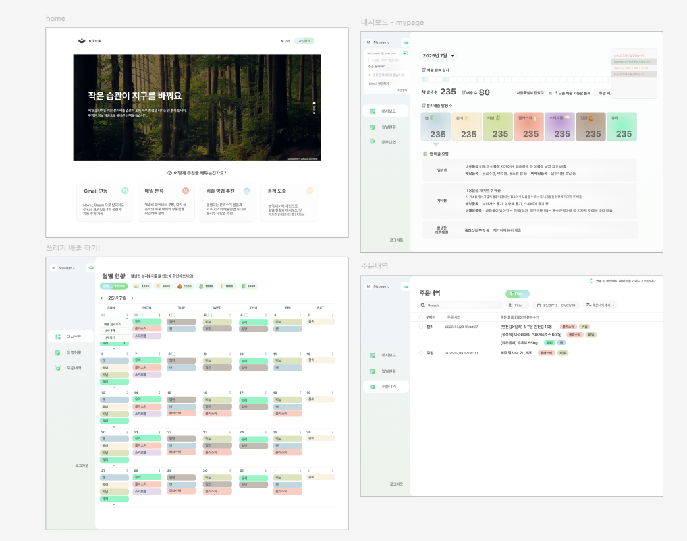

# 편리하게 추천하여, 깨끗한 지구를 향한 한걸음 가는 TUKTUK
---
### 단독 개발 (1인 프로젝트) 기간 : 8월 1일 ~ 11월 2일
* **서비스 기획 및 UI/UX 설계 (요구사항 정의, 스토리보드 및 디자인 시스템 구축)** : 8월 1일 ~ 8월 12일
* **핵심 기능 개발 (프론트엔드 React & 백엔드 Spring Boot)** : 8월 13일 ~ 10월 29일
* **클라우드 인프라 구축 및 DevOps 자동화 (Railway)** : 10월 30일 ~11월 2일

## 🌐프로젝트 링크 : https://beneficial-love-production.up.railway.app

### 🌏목적 및 동기
현재 온라인 쇼핑의 증가로 다양한 폐기물이 발생하는 상황에서, 분리배출이 번거로워서가 아니라 정확한 배출 기준을 알지 못해 잘못 배출하는 경우가 의외로 많습니다.

본 프로젝트는 **내 손을 거쳐가는 물건들**에 대해 정확한 분리배출 가이드를 제공함으로써, 사용자에게 올바른 배출 습관을 형성시키고 궁극적으로 환경 문제 해결에 기여하는 실용적인 서비스를 개발하는 데 목표를 두었습니다. 특히 기술을 통해 복잡한 규정을 단순화하고, 사용자의 환경 기여를 독려하는 데 초점을 맞추었습니다.

### 🔑핵심 기능 요약
1. Google 연동으로 Gmail 중 주문(**`배민 장보기`**, **`컬리`**, **`쿠팡`**)을 파싱하여 주문한 상품의 분리배출 방법 추천
2. **`PNG`**, **`JPG`** 을 OCR 통해 주문 상품 분리배출 방법 추천
3. 자신의 지역에 맞는 분리배출 요일 및 방법 추천
4. 총 발생한 수거품에서 배출하기 기능으로 배출 수치를 월별, 대시보드 통해 제공

## 2. 핵심 기술 스택
### 📦 Back-end & Database
* **Spring Boot 3.4.7** : 분리수거 물품 추천 결과에 대한 내용에 대해 비동기 트랜잭션으로 처리가 가능하고, 배출 규칙을 모듈화하여 관리합니다.

* **MySQL 8.0** : 관계형 데이터베이스의 무결성을 통해 **`품목`**<-> **`매칭키워드`** <-> **`분리수거물품`** 을 복잡하게 연결하여 데이터를 일관성 있게 관리합니다.

* **Redis 7** : Jwt Token 의 Refresh Token 저장과, 분리수거 물품 매칭에 핵심적인 **`Entity`** 를 **`Redis`** 에 **`Cache`** 로 저장하여 DB I/O 비용을 줄였습니다.

### 📦 React
* **React + TypeScript** : 컴포넌트 기반 UI 개발과 다양한 라이브러리와 함께 정적 타입 체크를 통한 안정적인 코드 작성을 위해 사용했습니다.

* **Vite** : 모던 빌드 환경을 구축하여 빠른 개발 서버와 최적화된 빌드 성능을 확보하여 개발하기 위해 사용했습니다.

### 📦 Infrastructure & DevOps
* **Docker** : Mysql, Redis, Spring 으로 구성된 다중 서비스 환경을 Docker-compose로 단일화 하여 실행에 복잡함이 없도록 했습니다.

* **Railway** : Railway를 활용하여 Docker 컨테이너를 효율적으로 배포 및 관리하고, Private Networking을 통해 백엔드와 데이터베이스(DB) 연결, 프론트엔드 간 안정적이고 최적화된 통신 환경을 구축 및 운영했습니다.

## 3. 아키텍처

## 4. ERD

## 5. 트러블 슈팅과 기술 결정 과정
* [이메일_인증_트러블슈팅](https://dadaeun7.github.io/p-tuk-tuk/troubleshooting/email_confirm.html)
* [docker_mysql_한글깨짐_트러블슈팅](https://dadaeun7.github.io/p-tuk-tuk/troubleshooting/docker_mysql_ko_error.html)
* [google_외부서비스_연동_트러블슈팅](https://dadaeun7.github.io/p-tuk-tuk/troubleshooting/google_connect.html)
* [Redis_캐싱_JPA_영속성_충돌_트러블슈팅](https://dadaeun7.github.io/p-tuk-tuk/troubleshooting/redis_caching_jpa_error.html)
* [캐싱_전략_최적화_Hybrid_Model_도입_트러블슈팅](https://dadaeun7.github.io/p-tuk-tuk/troubleshooting/hybrid_model.html)
* [JPA_영속성_동시성_Transactional_교착까지_이해와_해결_트러블슈팅](https://dadaeun7.github.io/p-tuk-tuk/troubleshooting/jpa_transactional_error.html)
* [OAuth2_콜백_URL_매칭_트러블슈팅](https://dadaeun7.github.io/p-tuk-tuk/troubleshooting/ouath2_callback_url_error.html)
* [React_Dexie_동기화_관련_트러블슈팅](https://dadaeun7.github.io/p-tuk-tuk/troubleshooting/react_dexie_sync.html)

## 6. 초기 UI_기획안

## 7. 앞으로의 목표

### ⚙️성능 및 핵심 로직 개선 목표
✅ **OCR 로직 안정화**

* 목표: OCR 결과에서 '상품명'을 추출하는 로직의 안정성을 확보합니다.
* 효과: 정확도 높은 품목 정보를 획득하고 서비스 신뢰도를 높입니다.

✅ **키워드 매칭 서비스 고도화**

* 목표: 현재의 단순 contain 방식에서 벗어나 Aho-Corasick 알고리즘 등 부하를 줄일 수 있는 로직을 도입합니다.
* 효과: 대규모 키워드 매칭 검색 성능을 획기적으로 향상시키고 백엔드 부하를 최소화합니다.

✅ **AI 의존성 감소**

* 목표: Item-Keyword 및 Keyword-Specific 데이터를 지속적으로 확보/정제합니다.
* 효과: AI 매칭 단계까지 가지 않도록 빠르고 비용 효율적인 1차 데이터 매칭 성공률을 극대화합니다.

---

### 🏗️ 아키텍처 및 확장성 강화
✅ **마이크로서비스(MSA) 전환 검토**

* 목표: 서비스 규모 확장 시, **`키워드/품목 매칭 서비스`** 를 독립적인 Spring 서버로 분리하고 Docker Container를 증설하여 운영합니다.
* 효과: 서비스별 독립적인 확장 및 배포를 가능하게 하여 시스템 안정성을 높입니다.

---

### ✨ 서비스 가치 확장
✅ **신규 컨텐츠 및 사용자 참여 유도**

* 목표: 분리수거 물품 데이터 및 사용자 배출 기록을 기반으로 **'환경 미션'** 이나 '포인트 제도' 등의 게임화(Gamification) 요소를 도입합니다.
* 효과: 사용자 참여율과 서비스 지속성을 높입니다.

✅ **모바일 App 출시**

* 목표: 웹 서비스 외에 모바일 전용 App을 출시합니다.
* 효과: 사용자의 접근성을 극대화하고, 푸시 알림 등을 통해 배출 습관 형성을 돕습니다.

---
